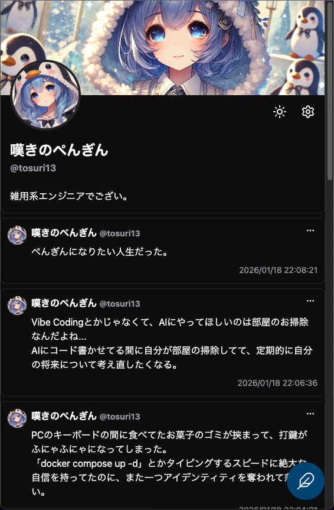
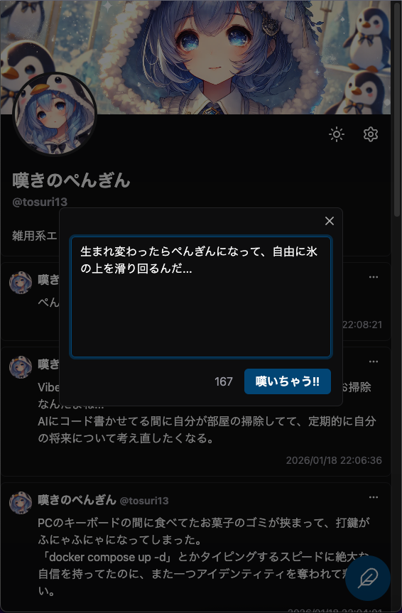
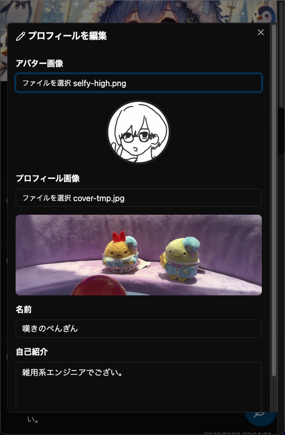
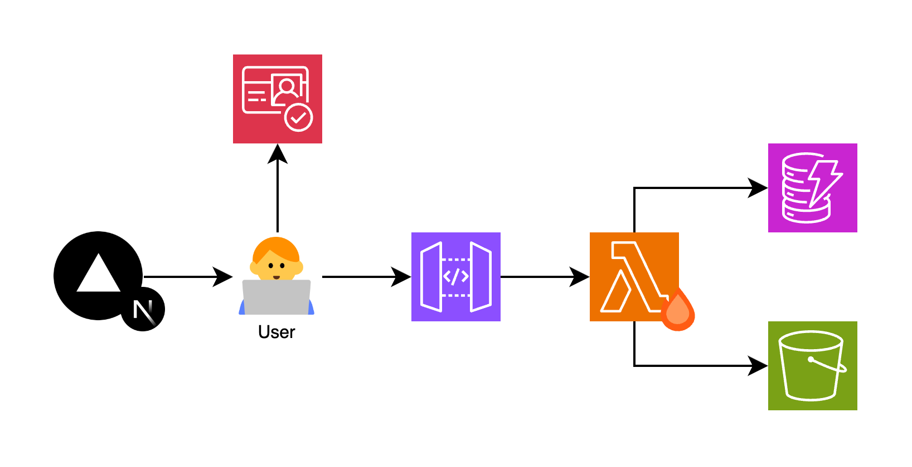

<div align="center">
  
  <h1>👻 Myrtle 👻</h1>
  日々の感情や愚痴を「<strong>嘆き</strong>」として書き出すための一人用SNS
</div>

## 🎉 Overview

「**Myrtle**」は、一人で利用することを前提としたSNS(**Solo Nageki Service**)アプリケーションです。

本当は言いたかったけど誰にも言えなかったこと、ムカついたけど言い返せなかったこと、ITエンジニア特有のお気持ち表明。公に共有されてしまうSNSでは投稿するのが憚られる「**負の感情**」を、Myrtleでは誰にも見られない場所で心ゆくままに「**嘆き**」として投稿することができます。

何でもかんでも公に投稿する前に、まずはMyrtleで感情を発散するといいでしょう。

<br>

<div align="center" style="display: flex; justify-content: center; gap: 8px;">
  
  
  
</div>

<br>

> ⚠️ 「一人用」のSNSなので、Vercelにデプロイされている公開URLを踏んでも、当サービスを利用することはできません。ただし、後述の開発手順で独自のVercel + AWS環境に同様のサービスをデプロイすることは可能です。

## 🤔 How's it work?

フロントエンドは**Next.js + Vercel**、バックエンドは**Hono + AWS**で動作しており、型定義やTypeScriptの設定を含む、それぞれのワークスペースを**Turborepo**でモノレポとして管理しています。

<div align="center">
  
</div>

#### 🌟 AWSを活用したバックエンドインフラストラクチャ

アプリケーションの認証認可には**Cognito**、ユーザ毎の嘆きなどのコンテンツ管理やプロフィール画像などのアセット管理には**DynamoDB + S3**、Honoのホスティングには**API Gateway + Lambda**を使用しています。

バックエンドインフラストラクチャは、全てAWSのサービス内で完結しており、**AWS SAM**を用いたIaCテンプレートを用いて簡単にデプロイすることができます。また、利用しているサービスは全て**サーバレス**であるため、基本的にはゼロコストで運用することができます。

#### 🔥　Honoを活用した型安全なAPI

Hono側で定義したAPIのエンドポイントを、**Hono RPC**としてクライアントサイドで利用することで、API Gatewayのレスポンスを型付けされた状態で扱うことができます。

Turborepoで起動したAPIサーバの変更がすぐにWebアプリケーション側に反映されるため、ローカル環境での開発をスムーズに行うことができます。

#### 🎨 shadcn/uiによる統一されたデザインシステム

ヘッドレスUIコンポーネントライブラリであるRadix UIをベースとした**shadcn/ui**を活用することで、柔軟かつ統一されたUIコンポーネント開発を実現しています。

shadcn/uiのデフォルトCSSをMyrtle独自のカラースキーマでオーバライドすることにより、リッチで重厚なUIコンポーネントを簡単に使用することができます。

#### 🚀 Turborepoによるフロント + バックエンドのモノレポ管理

Turborepoのキャッシュ管理により、開発用サーバの立ち上げ、AWSへのビルド + デプロイなどを効率良く実施できるように設定しています。

また、型定義やTypeScriptの設定を共有ワークスペースとして設定することで、フロント + サーバの両方から簡単に呼び出すことが可能です。

## 🧑‍💻 Development

- 開発用サーバの立ち上げ

```sh
turbo dev
```

> ⚠️ フロントエンド側の環境変数として、CognitoのユーザプールIDやアプリケーションクライアントID、開発用サーバのURLなどがエクスポートされている必要があります。
> 
> また、Cognitoのユーザ登録やパスワードの設定を事前にAWSコンソールから実施する必要があります(フロントエンドアプリケーションには該当の動線が存在しません)。

- バックエンドのビルドとAWSへのデプロイ

```sh
turbo aws:deploy
```

> ⚠️ 事前に`samconfig.toml`が設定されている必要があります。新たに設定ファイルを作成する場合は、該当のディレクトリまで移動し、`sam deploy --guided`でインタラクティブに設定することをオススメします。
